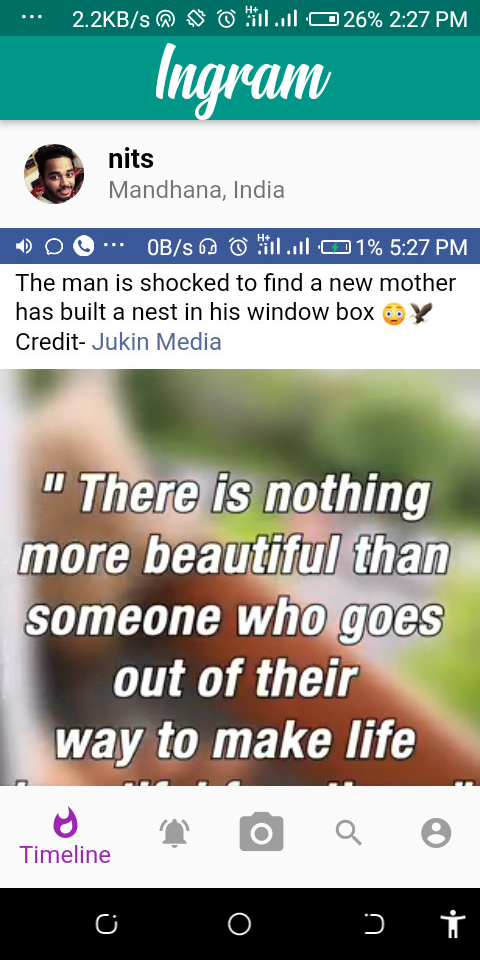

# instagram

Just a clone of the instagram app

## App Look Like

  

      

As the app is not complete yet... there are some more which will be added time to time as the early code contains the basic,
structure and functionality of the app..In this we use the firebase as backhand and flutter for development 

Flutter is the awsome framework that I come up with
keep supporting

## Happy Coding
